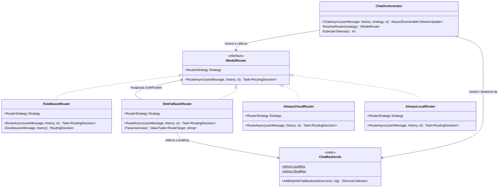
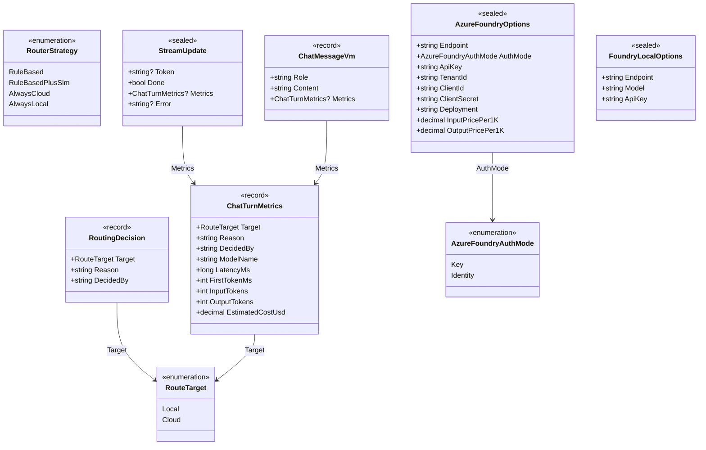
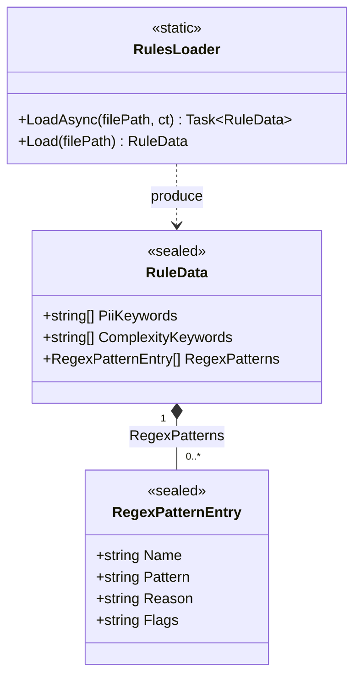

# HybridPingPong.Core

Questa libreria contiene la logica di dominio del progetto **HybridPingPong**. Fornisce un motore di routing AI ibrido che decide, per ogni turno di chat, se inoltrare la richiesta a un modello **locale** (Foundry Local) oppure al **cloud** (Azure AI Foundry). Il routing può essere puramente rule-based (deterministico e spiegabile), arricchito con un classificatore SLM per i casi ambigui, oppure configurato per usare sempre il modello cloud o sempre il modello locale.

Il progetto è organizzato in tre livelli:

| Cartella | Responsabilità |
|---|---|
| `Models/` | Contratti dati, opzioni di configurazione, enum e view model |
| `Services/` | Interfaccia del router, implementazioni dei router e orchestrator |
| `Utilities/` | Caricamento delle regole JSON e helper per i pattern |

---

## Diagrammi delle classi

### Services

---

### Models

---

### Utilities

