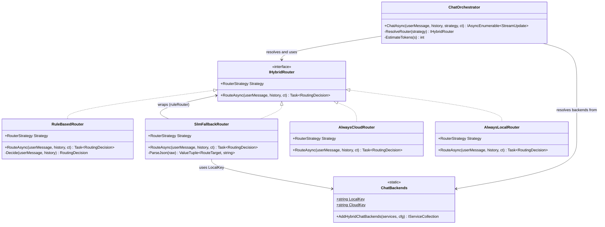
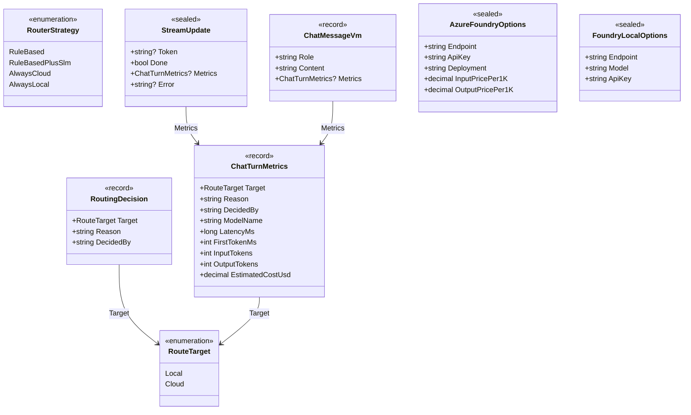
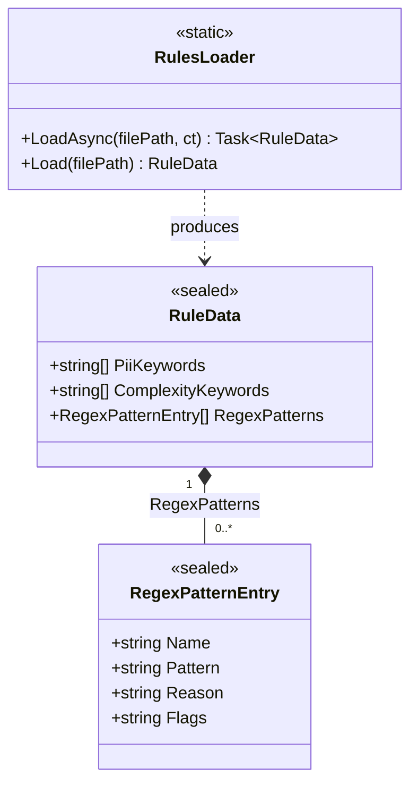

# HybridPingPong.Core

This library contains the domain logic for the **HybridPingPong** project. It provides a hybrid AI routing engine that decides, for each chat turn, whether to dispatch a request to a **local** model (Foundry Local) or to the **cloud** (Azure AI Foundry). The routing can be purely rule-based (deterministic, explainable), augmented with an SLM classifier for ambiguous cases, or configured to always use the cloud model or always use the local model.

The project is organised into three layers:

| Folder | Responsibility |
|---|---|
| `Models/` | Data contracts, options, enums, and view models |
| `Services/` | Router interface, router implementations, and the orchestrator |
| `Utilities/` | JSON rule loading and pattern helpers |

---

## Class Diagrams

### Services

---

### Models

---

### Utilities

